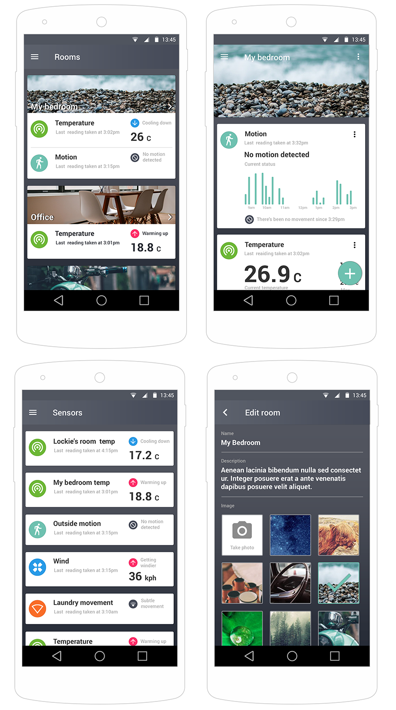

# Autumn
Autumn is a home automation platform using [Meteor.js](http://meteor.com/), some [Raspberry Pis](https://www.raspberrypi.org/), and lots of [Arduinos](http://arduino.cc/).



## Current state
This is still very much a work in progress and there's a lot of work to do. The current state is that you can send info from a Raspberry Pi to the deployed app but that's about it (and even then not all the code is currently up on Github so you're on your own a bit there too). I'm still a way of getting the Raspberry Pi to turn things on and off.

All my testing has been done on a Nexus 5 so your milage may vary. My bet is that it's the CSS that get's all screwy. So, it's currently Android only I guess. You could try this on iOS and see what breaks...

### Running

Note that unless you're developing against this there's no real benefit as no real work has yet been made on the hub side of things.

- Ensure you have Meteor installed on your system

```
curl https://install.meteor.com | sh
```

- Clone the project

```
git clone https://github.com/autumnapp/app.git
cd app
```

- Update the packages

```
meteor udpate
```

- Run (will run on default URL http://localhost:3000)

```
meteor
```

### Running on your phone

- Plug in your phone

- Ensure you have the platforms installed on your system

```
meteor install-sdk android
meteor add-platform android
```

- Deploy

```
meteor run android-device
```

### Deploying

- Deploy to Meteor's servers

```
meteor deploy my_app_name.meteor.com
```

- Run on your phone with the mobile server being set to your new app url

```
meteor run android-device --mobile-server my_app_name.meteor.com
```

## Things to still do
- Comment and document
- Add more sensor types and associated graph data
- Create admin app
- Optimise and secure (currently very open and account data is easily intercepted)
- Add other repos for Arduino code
- Complete the simple hub app
- Deploy on something other than Meteor's servers
- Debug on other Android devices.
- Figure out some way of breaking up the packages in a manner that doesn't use Atmosphere... although maybe this isn'a that bad of a deployment mechanism. I'd prefer github TBH
